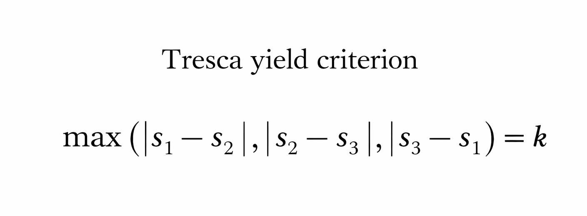
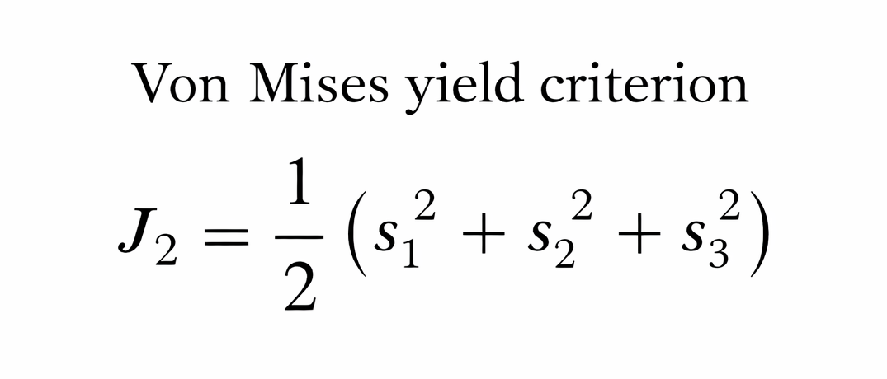
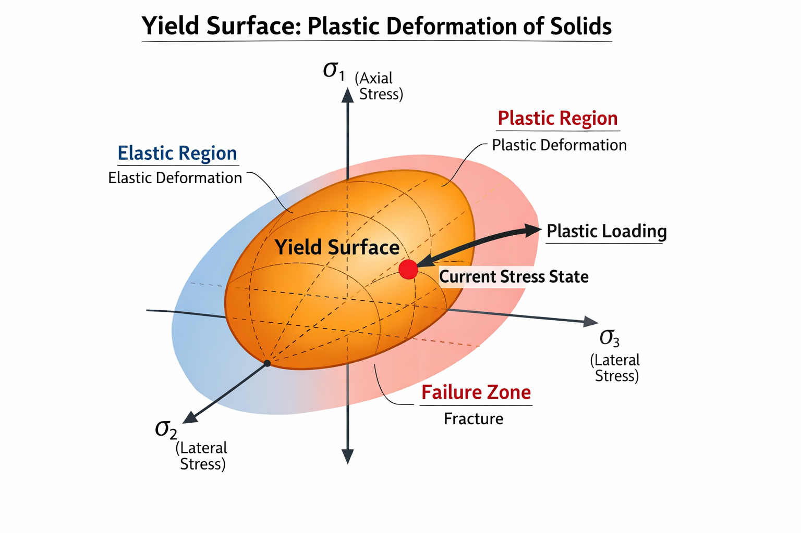

# Open platform for video-based education

> Course project for `DESIGN-374A`

## Overall goal

Make learning complicated physics concept much more appealing.

## Strategy for generating the video

* add subtitles (with user corrections).
* explanation slides in between for clarity.
* schematics inserted in the videos.
* combination of instructor video and AI-generated videos -- ensure correctness.

## Demonstration -- teaching the concept of yield surface for plastic deformation

The target video introduces **yield surfaces** for plastic deformation: what they are, how they are used in plasticity, and two classical criteria—**von Mises** and **Tresca**. It explains the idea of a surface in principal-stress space that separates elastic and plastic response, then shows the corresponding shapes and equations so viewers can compare the two criteria.

| Yield surface (Tresca) | Yield surface (von Mises) | Combined view |
|:---:|:---:|:---:|
|  |  |  |

* Results to be uploaded to personal YouTube channel [@hanfengzhai](https://www.youtube.com/@hanfengzhai).

